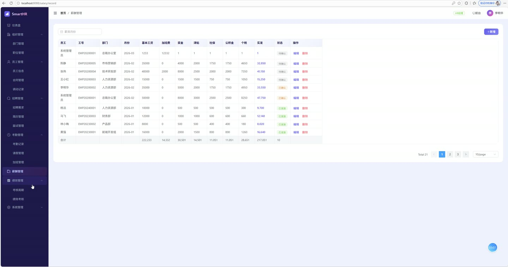
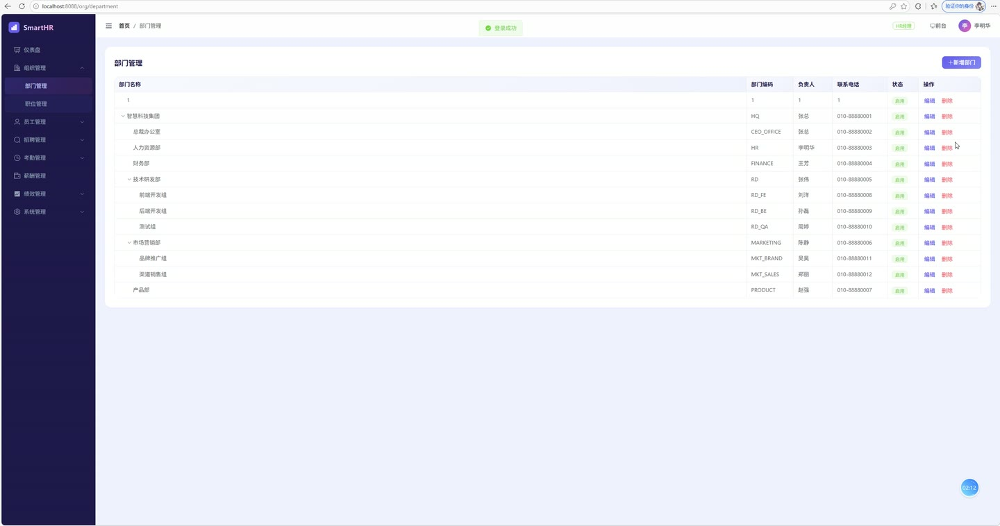
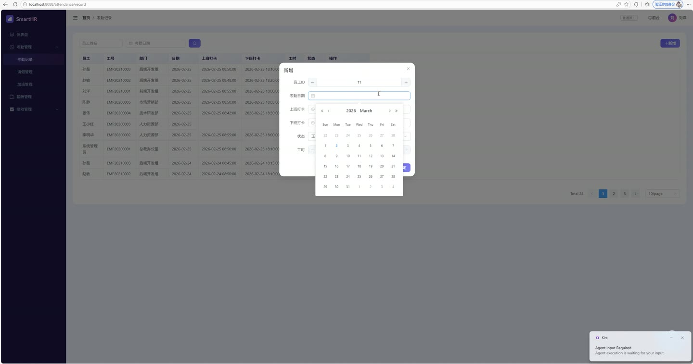
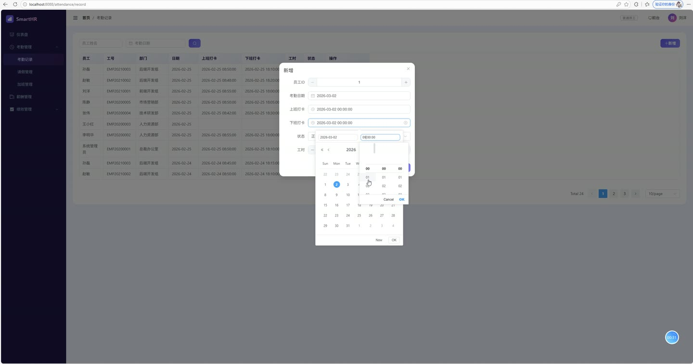
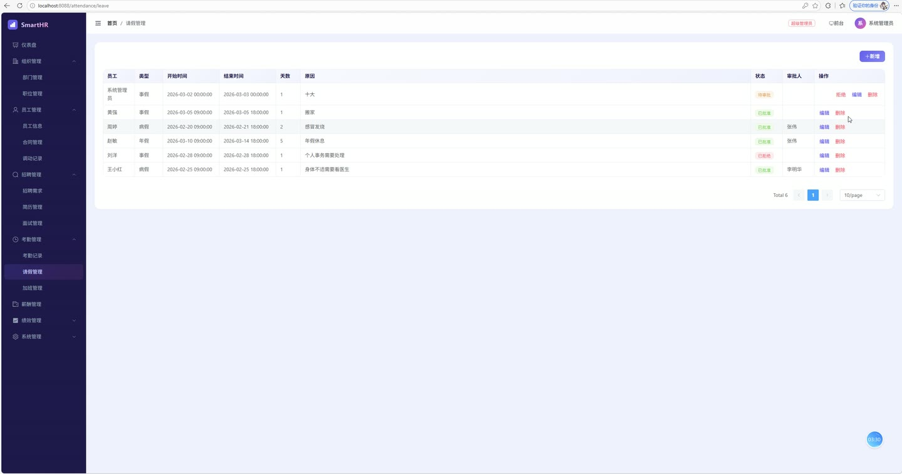

# (附文档)Springboot3+Vue3+MySQL 智慧人力资源管理系统

**技术栈**：Springboot3、Vue3、MySQL

### 系统简介

智慧人力资源管理系统是一套基于 SpringBoot3 + Vue3 前后端分离架构的企业级人力资源管理平台，覆盖门户展示、招聘管理、员工管理、考勤管理、薪酬管理、绩效考核、系统配置等核心业务环节。系统内置超级管理员、HR经理、HR专员、部门经理、普通员工五种角色，通过 JWT 认证与路由级权限控制实现精细化访问管理，满足企业人力资源数字化管理需求。
 
### 核心功能
 
### 门户端

 
- 门户首页展示启用状态轮播图（按排序值升序展示，仅显示状态为启用的 Banner） 
- 公告列表分页展示（仅显示已发布公告，置顶公告优先排序，支持查看详情并自动累加浏览量） 
- 招聘职位列表分页展示（仅显示招聘中岗位，按发布时间倒序排列，支持查看职位详情） 
- 职位详情页展示岗位名称、薪资范围、学历要求、经验要求、职位描述及任职要求 
- 公告详情页展示公告标题、正文内容、公告类型及封面图，浏览时自动增加浏览次数
 
### 管理员端

 
- 仪表盘统计核心数据：在职员工数、试用期员工数、部门总数、待审批请假数、招聘中岗位数 
- 部门管理：维护部门树形结构（支持多级父子层级）、部门编码、负责人、联系电话、排序值及启用状态 
- 岗位管理：维护岗位名称、岗位编码、岗位级别、所属部门及启用状态，分页展示岗位列表 
- 员工管理：维护员工档案（工号、姓名、性别、出生日期、身份证号、手机号、邮箱、地址、学历、毕业院校、专业、紧急联系人等），支持按姓名、部门、状态筛选，关联部门与岗位名称 
- 合同管理：维护员工劳动合同（合同编号、合同类型、起止日期、薪资、状态、附件），支持分页查询并关联员工姓名与工号 
- 异动管理：记录员工调动信息（调动类型、原部门/新部门、原岗位/新岗位、调动原因、生效日期、操作人） 
- 招聘需求管理：维护招聘岗位需求（招聘部门、岗位名称、招聘人数、薪资范围、学历要求、经验要求、职位描述、任职要求、状态） 
- 简历管理：维护候选人简历（姓名、性别、电话、邮箱、学历、毕业院校、专业、工作年限、期望薪资、自我介绍、附件），关联应聘岗位 
- 面试管理：安排面试（关联简历、面试官、面试时间、面试类型、地点、评价、评分、面试结果） 
- 考勤记录管理：维护每日考勤记录（员工、日期、上班打卡时间、下班打卡时间、状态、工时、备注），支持按员工姓名及日期筛选 
- 请假管理：维护请假申请（请假类型、开始/结束时间、请假天数、原因），支持审批通过/驳回并记录审批人、审批时间及审批备注 
- 加班管理：维护加班记录（加班日期、开始/结束时间、加班时长、原因、状态） 
- 薪酬管理：维护月度薪酬记录（基本工资、加班费、奖金、津贴、扣款、社保、公积金、个税、实发工资），支持按月份筛选 
- 绩效周期管理：维护绩效考核周期（周期名称、周期类型、开始/结束日期、状态） 
- 绩效记录管理：维护员工绩效考核结果（自评分数、自评意见、经理评分、经理意见、最终得分、评级、状态），关联考核周期 
- 公告管理：维护系统公告（标题、内容、公告类型、封面图、状态、置顶标志），支持分页查询并按置顶优先排序 
- 轮播图管理：维护门户轮播图（标题、图片地址、链接地址、排序值、启用状态） 
- 用户管理：维护系统登录用户（用户名、密码、姓名、头像、邮箱、手机号）及角色分配 
- 角色管理：维护系统角色（角色名称、角色编码、描述、状态），支持按用户查询已分配角色 
- 数据字典管理：维护系统字典类型及字典项（字典类型、标签、值、排序、状态） 
- 操作日志管理：记录用户操作日志（操作人、操作内容、请求方法、请求参数、IP地址、耗时、状态） 
- 文件上传：支持上传图片及附件，返回可访问的文件访问路径，限制单文件 10MB
 
### 技术栈

 后端框架Spring Boot 3.x ORM 框架MyBatis-Plus（含分页插件、逻辑删除） 权限认证Spring Security + JWT（Token 认证） 前端框架Vue 3（Composition API） 状态管理Pinia 路由管理Vue Router 4（含路由级权限控制） UI 组件库Element Plus 构建工具Vite 数据库MySQL 8.x 日期序列化Jackson + JavaTimeModule（支持 LocalDateTime/LocalDate 格式化）
 
### 交付内容

 
- 后端完整源码 
- 前端完整源码 
- 数据库初始化脚本 
- 万字文档

## 界面展示

---

## 获取完整源码 + 万字文档

本仓库为项目介绍页。**完整前后端源码、数据库初始化脚本、万字项目文档**，请加微信 `kangkangcode`，或访问 [codekk.top](http://codekk.top) 获取。

可作课程设计 / 毕业设计参考，支持远程部署调试。